# frond 🌴

[](https://github.com/nvandessel/frond/actions/workflows/ci.yml)
[](https://codecov.io/gh/nvandessel/frond)
[](https://goreportcard.com/report/github.com/nvandessel/frond)
[](https://github.com/nvandessel/frond/releases/latest)

Minimal, agent-first CLI for managing stacked PRs with DAG dependencies on GitHub. 

Single binary. Zero config.

```mermaid
graph TD
    main[main]
    payments[feature/payments]
    stripe["pay/stripe-client ✓"]
    tests["pay/stripe-tests ✓"]
    schema["pay/db-schema ✓"]
    migrations["pay/db-migrations ✓"]
    handlers["pay/api-handlers ⏳"]
    e2e["pay/e2e ⏳"]

    main --> payments
    payments --> stripe
    stripe --> tests
    payments --> schema
    schema --> migrations
    payments --> handlers
    payments --> e2e

    stripe -. "must merge first" .-> handlers
    schema -.-> handlers
    handlers -.-> e2e
    tests -.-> e2e
    migrations -.-> e2e

    style main fill:#e9ecef,stroke:#495057,color:#1e1e1e
    style payments fill:#a5d8ff,stroke:#1971c2,color:#1e1e1e
    style stripe fill:#b2f2bb,stroke:#2f9e44,color:#1e1e1e
    style tests fill:#b2f2bb,stroke:#2f9e44,color:#1e1e1e
    style schema fill:#b2f2bb,stroke:#2f9e44,color:#1e1e1e
    style migrations fill:#b2f2bb,stroke:#2f9e44,color:#1e1e1e
    style handlers fill:#ffec99,stroke:#e8590c,color:#1e1e1e
    style e2e fill:#ffec99,stroke:#e8590c,color:#1e1e1e

    linkStyle 0,1,2,3,4,5,6 stroke:#495057,stroke-width:2px
    linkStyle 7,8,9,10,11 stroke:#9c36b5,stroke-width:2px,stroke-dasharray:5 5
```



> **Solid** = `--on` (git parent / PR base) · **Dashed** = `--after` (merge dependency)
>
> Green = ready to merge · Yellow = blocked by dependencies

## Install

**Homebrew** (macOS/Linux):
```bash
brew install nvandessel/frond/frond
```

**Binary download**: grab the latest from [GitHub Releases](https://github.com/nvandessel/frond/releases/latest).

**From source**:
```bash
go install github.com/nvandessel/frond@latest
```

Requires [git](https://git-scm.com/) and [gh](https://cli.github.com/) (authenticated).

### Shell completions

```bash
frond completion bash > /etc/bash_completion.d/frond      # bash (Linux)
frond completion zsh > "${fpath[1]}/_frond"                # zsh
frond completion fish > ~/.config/fish/completions/frond.fish  # fish
```

## Usage

```bash
frond new feature/auth                                        # create tracked branch
frond new auth/login --on feature/auth                        # child branch
frond new auth/e2e --on feature/auth --after auth/login       # with dependency
frond push -t "Login flow"                                    # push + create PR
frond status                                                  # show dependency graph
frond sync                                                    # fetch, cleanup merged, rebase
```

```
main
├── feature/auth  #42
│   ├── auth/login  #43  [ready]
│   ├── auth/signup  #44  [ready]
│   └── auth/e2e  (not pushed)  [blocked: auth/login, auth/signup]
```

## Commands

| Command | Description |
|---------|-------------|
| `frond new <name> [--on <parent>] [--after <deps>]` | Create tracked branch |
| `frond push [-t title] [-b body] [--draft]` | Push + create/update PR |
| `frond sync` | Fetch, detect merges, reparent, rebase |
| `frond status [--json] [--fetch]` | Show dependency graph |
| `frond track <branch> --on <parent> [--after <deps>]` | Track existing branch |
| `frond untrack [<branch>]` | Remove from tracking |

`--json` on every command. Exit codes: 0 success, 1 error, 2 conflict.

## Stacking patterns

`--on` creates the git/PR hierarchy (deep stacking). `--after` creates logical dependencies (wide fan-out). Combine both for real-world use:

```bash
frond new feature/payments        --on main
frond new pay/stripe-client       --on feature/payments
frond new pay/stripe-tests        --on pay/stripe-client                              # deep: stacks on stripe-client
frond new pay/db-schema           --on feature/payments
frond new pay/db-migrations       --on pay/db-schema                                  # deep: stacks on db-schema
frond new pay/api-handlers        --on feature/payments  --after pay/stripe-client,pay/db-schema    # wide: fan-out deps
frond new pay/e2e                 --on feature/payments  --after pay/api-handlers,pay/stripe-tests,pay/db-migrations
```

```
main
└── feature/payments                        PR → main
    ├── pay/stripe-client                   PR → feature/payments  [ready]
    │   └── pay/stripe-tests                PR → pay/stripe-client  [ready]
    ├── pay/db-schema                       PR → feature/payments  [ready]
    │   └── pay/db-migrations               PR → pay/db-schema  [ready]
    ├── pay/api-handlers                    PR → feature/payments  [blocked: stripe-client, db-schema]
    └── pay/e2e                             PR → feature/payments  [blocked: api-handlers, stripe-tests, db-migrations]
```

When `pay/stripe-client` merges, `frond sync` reparents `pay/stripe-tests`, unblocks `pay/api-handlers`, and rebases what's ready.

## Key concepts

<table>
<tr>
<td width="50%">

**`--on`** sets the git parent (PR base)


Each branch has one parent. PRs target their parent branch.

</td>
<td width="50%">

**`--after`** sets merge dependencies

```mermaid
graph TD
    login["auth/login ✓"]
    signup["auth/signup ✓"]
    e2e["auth/e2e ⏳"]

    login -. "must merge first" .-> e2e
    signup -.-> e2e

    style login fill:#b2f2bb,stroke:#2f9e44,color:#1e1e1e
    style signup fill:#b2f2bb,stroke:#2f9e44,color:#1e1e1e
    style e2e fill:#ffec99,stroke:#e8590c,color:#1e1e1e

    linkStyle 0,1 stroke:#9c36b5,stroke-width:2px,stroke-dasharray:5 5
```



Zero or more deps per branch. Controls merge ordering, not PR targeting.

</td>
</tr>
</table>

- These are **orthogonal** — `--on` for PR targeting, `--after` for merge ordering.
- State lives at `<git-common-dir>/frond.json` — shared across worktrees, invisible to the working tree.
